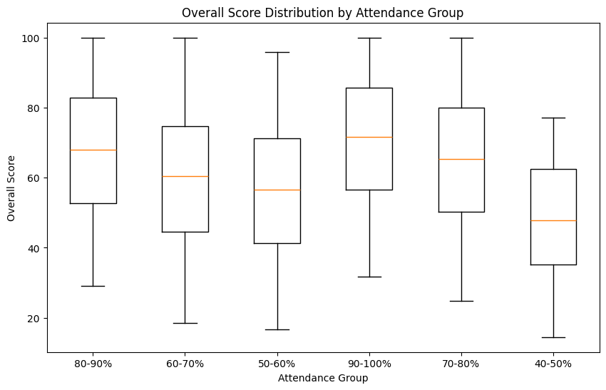
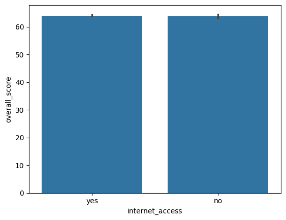
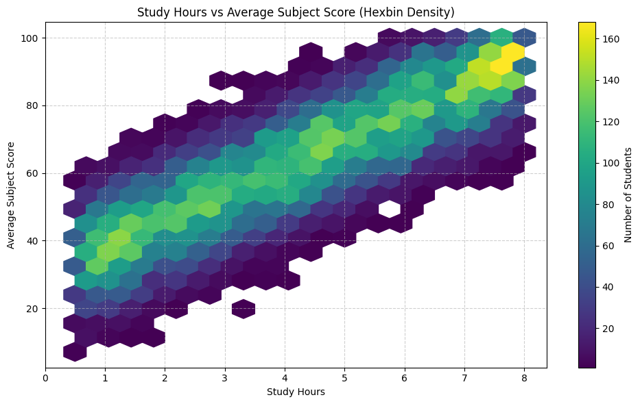
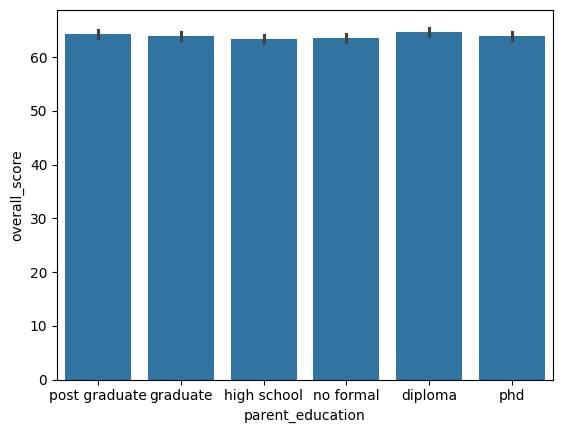

# Student-Performance-EDA
An EDA project investigating key drivers of student academic success, including attendance, weekly study hours, parental education, internet access, and subject correlations.
## Dataset
- Source: [Kaggle Student Performance Dataset](https://www.kaggle.com/datasets/kundanbedmutha/student-performance-dataset)
- File: `Student_Performance.csv`
- Contains student demographic information, study habits, attendance metrics, and subject scores in Mathematics, Science, and English.

## Notebook
- `student_performance_eda.ipynb`: Includes data cleaning, descriptive statistics, visualizations, and analytical insights.

## Key Findings
- Higher attendance and increased study hours are associated with improved academic performance.
  
- Internet access shows no clear link to higher overall scores—students with and without it perform similarly.
  
- Math, Science, and English scores are strongly connected: good performance in one usually means good performance in the others.
  
- Parental education level has little to no effect on student scores in this dataset.
  
## Requirements
- Python 3
- Libraries: pandas, matplotlib, seaborn, numpy
